# Compte rendu exam de Jenkins

### 1. Checkout pour assurer que le code bien récuperer
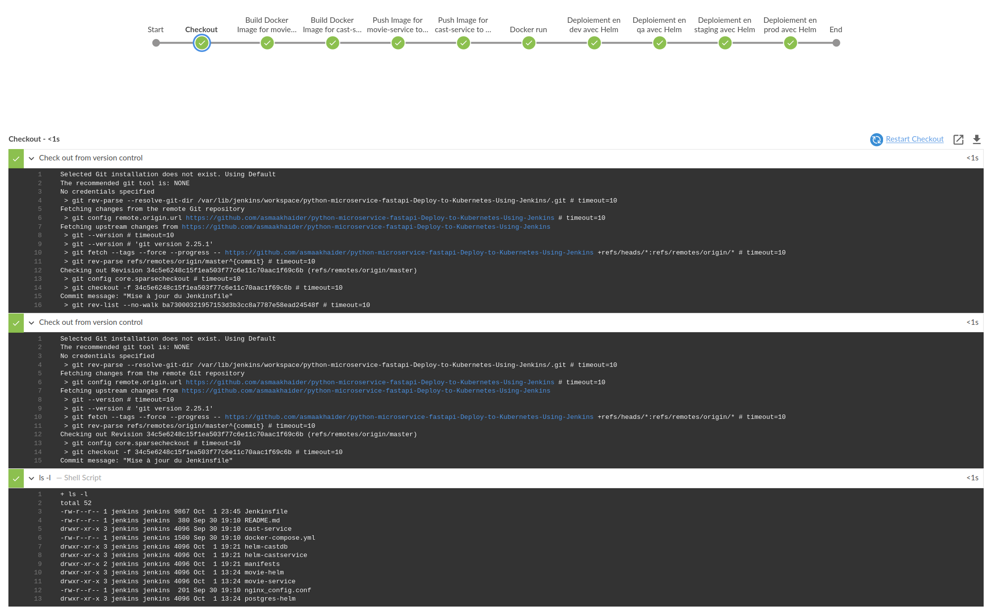

### 2. Build Docker image pour movie service
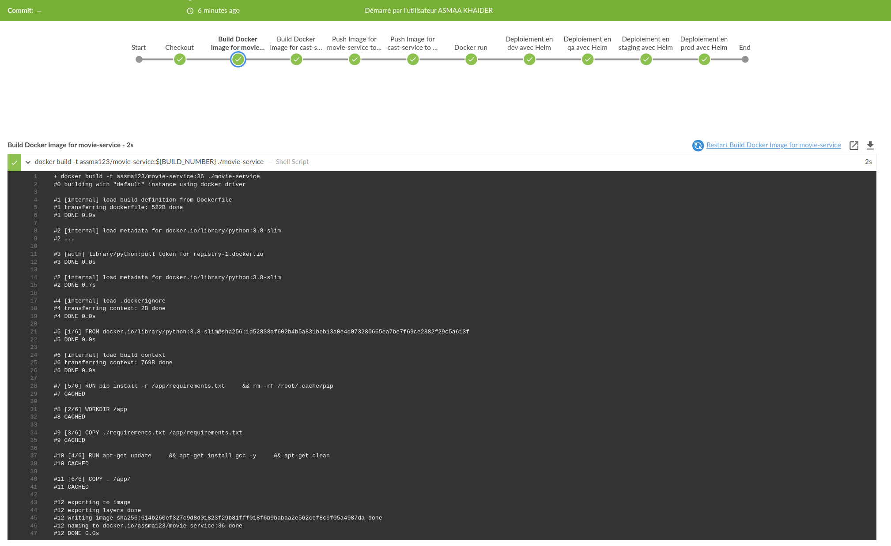
### 3. Build Docker image pour cast service 
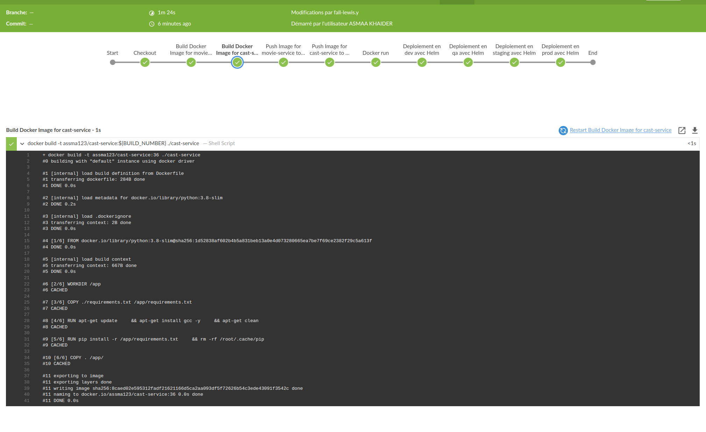
### 3. Push Docker image pour movie service

### 4. Push Docker imge pour cast service
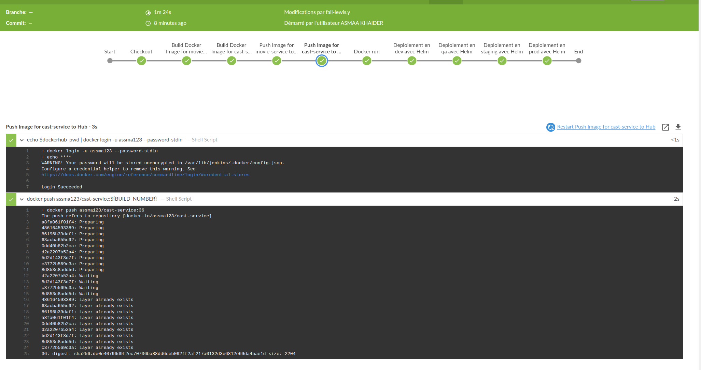
### 5. run Docker image a container
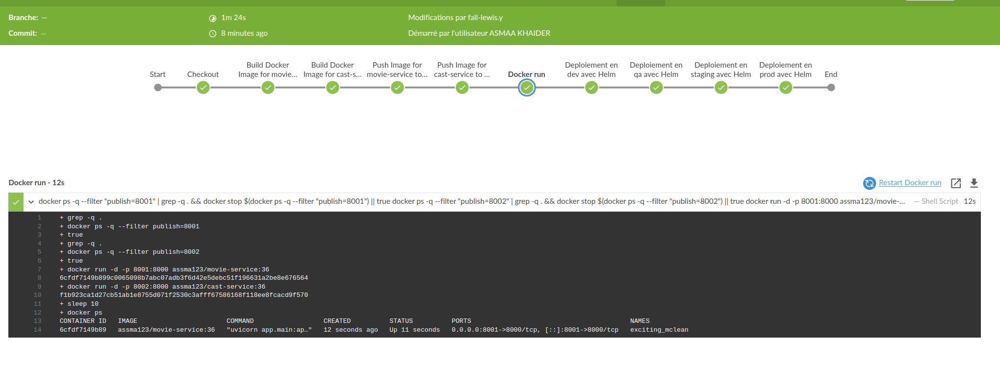
### 6. Résultat du déploiement de microservices sur Kubernetes avec Helm dans différents namespaces.
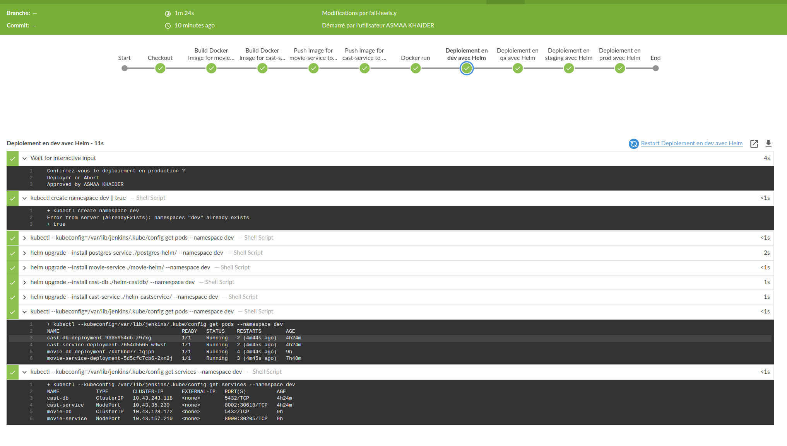
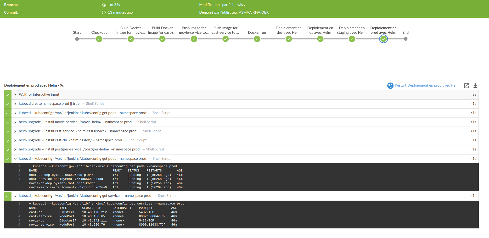
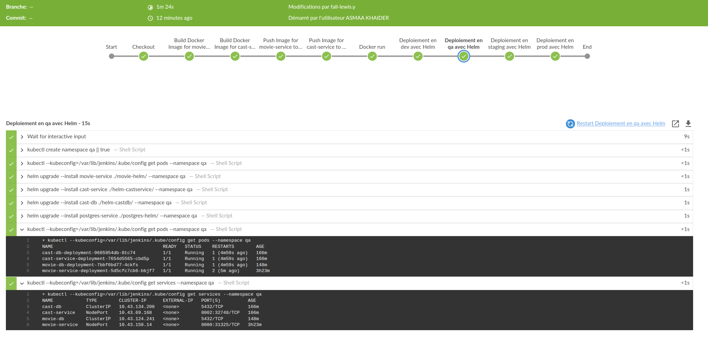
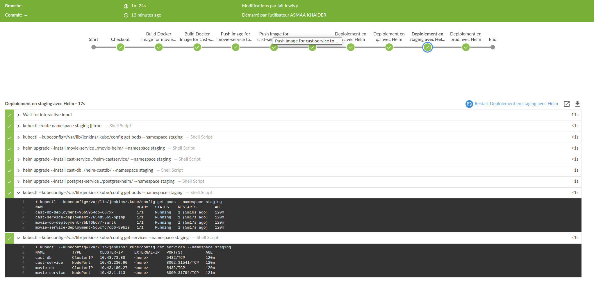
### 7. Test de différentes URL de microservices
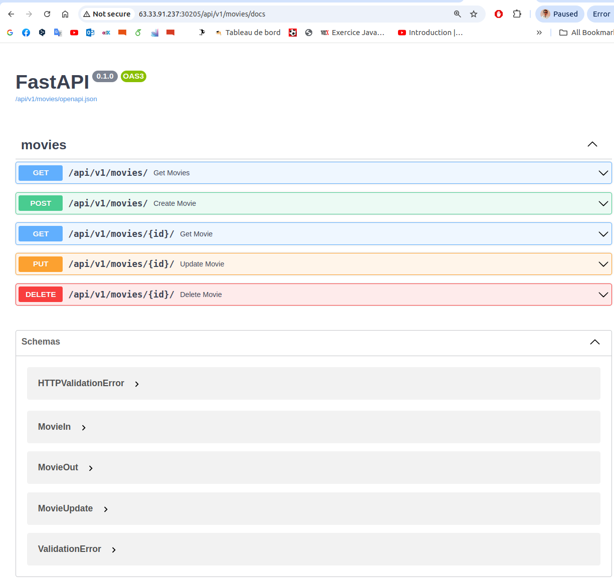
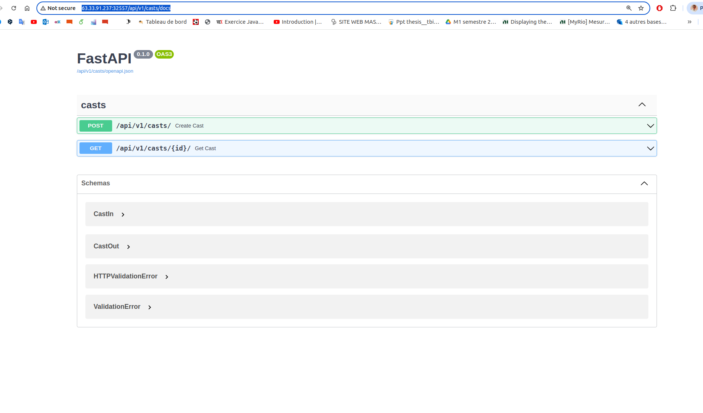
### 8. Existence des images poussées
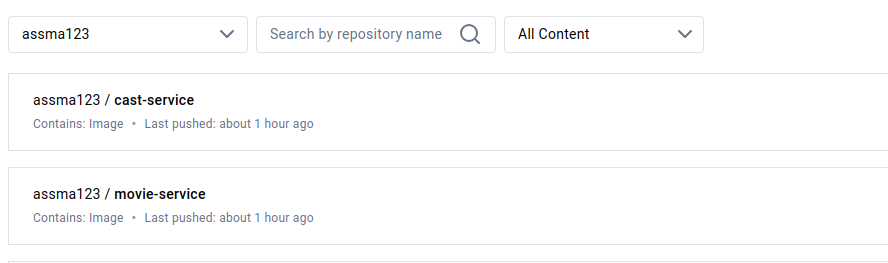
### 9. Deployement Manuellement
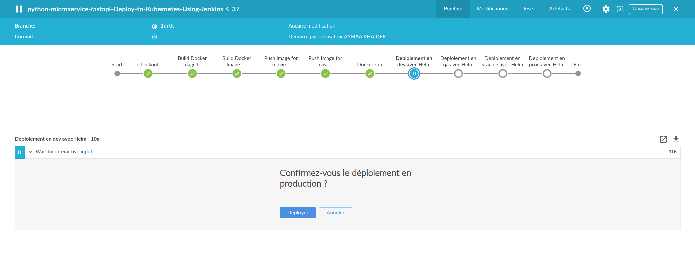